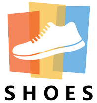

# :writing_hand: <span style="color: lightcoral;"> **Assignment 5**</span>  <span style="color: turquoise;">*(Next.js Storefront)*</span>
 :calendar: 22th, April 2022 <br/>
 :clock11: 15:59pm <br/>
 :package: <span style="color: red; font-weight:700">20%</span>

  - [General Info about project](#general-info)
  - [Installation](#installation)
  - [Setup](#setup)
  - [Conclusion](#conclusion)


##  :books: <span style="color:FFF3E0; font-weight:500" id="general-info">General Info</span>

&nbsp;&nbsp;&nbsp;&nbsp;This project aims to create in &nbsp; <span style="color: green; font-weight:600; font-size: 1.2rem">  *Node.Js* &nbsp;</span> an online footwear dashboard store for men, women, and children. The name of this store is <span style="color:#EF5350; font-weight:600"> *"Shoes EC"*</span>. The purpose of this project is to create storefront page which will contain a minimum of 3 products that my company wishes to sell.<br/>
&nbsp;&nbsp;&nbsp;&nbsp;More than that, I will use the REST API provided by the
Real-Time Database to connect my product data to my store. For my store, I used &nbsp;</span>&nbsp; which provided me with a full stack (client/server) react framework. I used in this project **Stripe.js** which is a JavaScript library for building my payment flows. Stripe Checkout to take payments for our products.<br/>
This project is launched on &nbsp; <span style="color: lightseagreen; font-weight:600; font-size: 1.2rem">  </span>, uses the &nbsp; <span style="color: #FF9C0B; font-weight:600; font-size: 1.2rem"> *Firebase* &nbsp;</span> database storage system, and the repository can be found on the *Github* link and *Vercel*.<br/>
Good Luck !!!

##  :computer: <span style="color:78909C; font-weight:500" id="installation">Installation</span>
1.  Install all packages/dependencies:
    - Open VSCode command line. View > Terminal
    - In the command line issue the following terminal command
```
  npm install
```
2. Run the server
     - Run the server before can be used
  ```
    npx next dev
  ```
3. Server will run in console:
   - wait a few seconds, the first time the server needs more time than usual, just click on 
```
  http://localhost:3000
```

## :gear: <span style="color:81C784; font-weight:500" id="setup">Setup</span>

&nbsp;&nbsp;&nbsp;&nbsp;In elaborating this task, I fulfilled all the conditions required by the teacher. At the time of launching the page, the customer will receive the `"Dashboard"` page with 3 products that have been read from the `"Firebase"` database. Each product will contain the name of the product, its price, a description of the product, and a `"Buy"` button to give the customer the opportunity to purchase that product. The next step is to scale and transfer the product selected by the customer to the payment process stage.
  Here the customer will have the opportunity to enter personal and bank details to complete the payment process. After entering the correct data in all the fields required by our store, the client will appear the `"Buy"` button. At this time the bank and personal data will be transmitted to the `"Stripe"` server where they will be processed.<br/>
<br/>

>## :hammer_and_wrench: New Implementation
<br/>
&nbsp;&nbsp;&nbsp;&nbsp;In this assessment 5, I completed the product write functionality and implement the read functionality to view minimum 3 products panes. The first step is to read the data from <span style="color: #FF9C0B; font-weight:600; font-size: 1.2rem"> Firebase &nbsp;</span> virtual database to present to the client. This theft and presentation of products will only be possible via "UID". Thanks to this unique id we can identify each product without having conflict with other cards. Data processing and theft takes place at a relative speed and is protected by a single secure key that is not published anywhere.
The main purpose of this payment process is to offer the customer the opportunity to easily and easily access all the products of our online store. We want our licenses to be fully satisfied and to recommend our products to other new members.
<br/>
<br/>

## :pencil: <span style="color:CE93D8; font-weight:500" id="conclusion">Conclusion</span>
Finally, we can mention that this project is a successful one. Website offers more opportunities to our clients. This product is easy to use, navigate and has a high-quality standard.
Everything presented here aims to accomplish the mission offered to the <span style="color:#3F51B5; font-weight:700">NAIT</span> higher education institution. All copyrights are legally reserved, and the purpose of this product is to show how we can use the Firebase database.

&nbsp; 

## :label: [](https://app.netlify.com/sites/ec-shoes-assessment1-eugeniuceban/overview) [](https://GitHub.com/Naereen/StrapDown.js/graphs/commit-activity) [](http://shields.io/) [](https://svgshare.com/i/ZhY.svg) [](https://svgshare.com/i/ZjP.svg) [](https://GitHub.com/Naereen/ama)


[](https://developer.mozilla.org/en-US/docs/Web/HTML)
[](https://developer.mozilla.org/en-US/docs/Web/CSS)
[](https://sass-lang.com/)
[](https://www.javascript.com/)
[](https://www.javascript.com)

[](https://www.npmjs.com/)

[](https://https://npmjs.com/)
[](https://npmjs.com/package/express)
[](https://code.visualstudio.com/)
[](https://code.visualstudio.com/)


[](https://GitHub.com/Naereen/StrapDown.js/network/)
&ensp;

### 	:link: Connection


&ensp;

### :mortar_board: Skills


[](https://reactjs.org/)

&ensp;

&ensp;

#### *Personal icons*
:mortar_board:
:computer:
:lock_with_ink_pen:
:bulb:
:hammer:
:wrench:
:email:
:key:
:lock:
:mailbox_with_mail:
:black_nib:
:pencil2:
:pushpin:
:file_folder:
:calendar:
:open_file_folder:
:paperclip:
:hammer_and_wrench:
